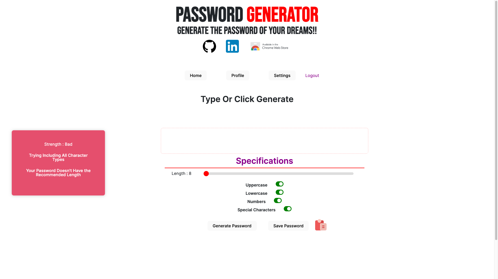
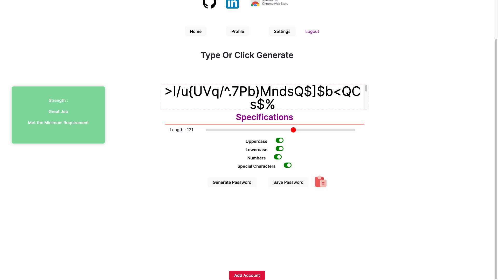
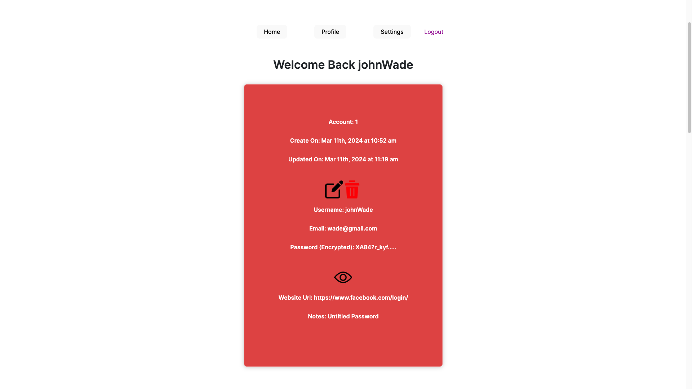
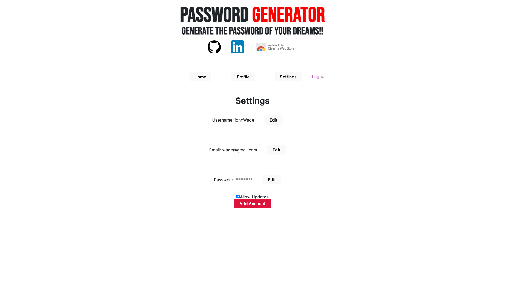

# Password Manager

Meant to manager your passwords 

## Features
* Generate secure passwords based on your own criteria
* Create an account to save your password for later use
* Strength Detection for passwords ones that are generated or typed
* Get Email Notifcations for your weak passwords

## Images

### Installing
Simply Go to the [Deployed Website](https://passwordmanager-zep7.onrender.com/) 

Stop by the chrome webstore for the [Password Manager](https://chromewebstore.google.com/detail/passwordmanager/ojofepogaljojmebppebofcemchchbnf?authuser=0&hl=en) extention

## Help
Since I created this project on my own and my first time ever building a chrome exetenison I'm sure there's alot of bugs and features I could add in the future 

## Authors

Contributors names and contact info

[Damion Morgan](https://github.com/BeginnerLevelUP)

## Version History

* 0.1
    * Initial Release

## License

This project has no license 

